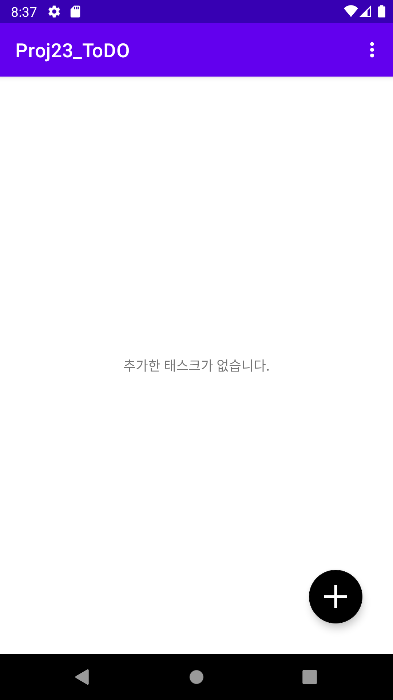
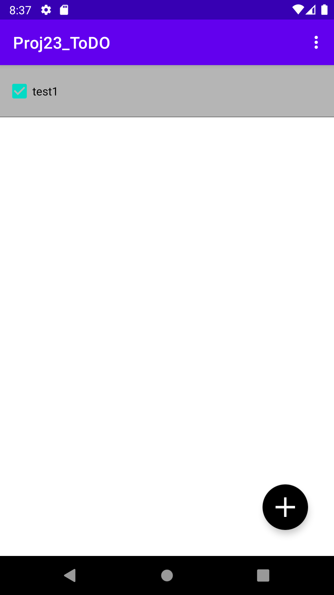
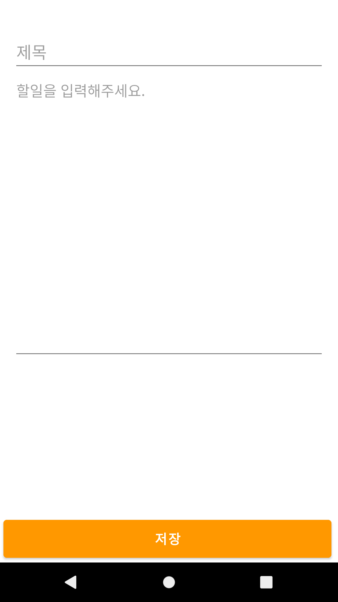
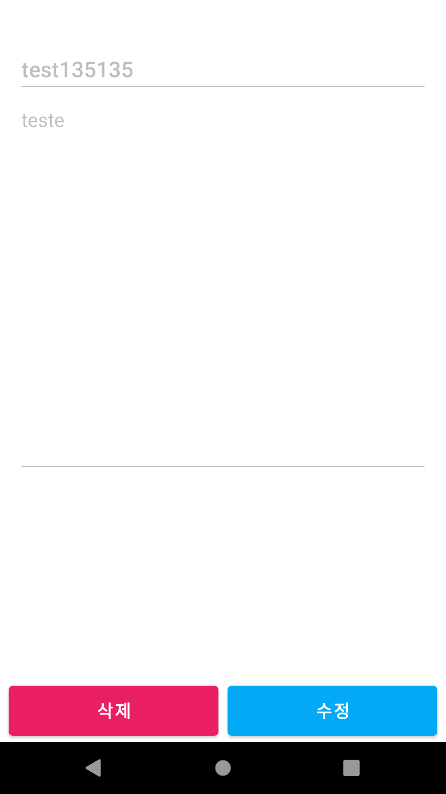

# Android Clone Coding Project #23 ToDo앱
오늘의 일정을 등록할 수 있음
 
오늘의 일정을 완료하였는지 볼 수 있음
 
오늘의 일정을 수정 삭제가 가능함
 
오늘의 일정을 모두 삭제가 가능함
 

# 결과화면
|Screenshot1|Screenshot2|
|---|---|
|||
|||

 

# 배운 내용 정리
- TDD 방식으로 개발 및 세팅
- Koin 사용하기
- Coroutines 사용하기
- Room 사용하기
- Livedate 사용하기
- AAC ViewModel 사용하기
- MVVM 패턴 사용하기

